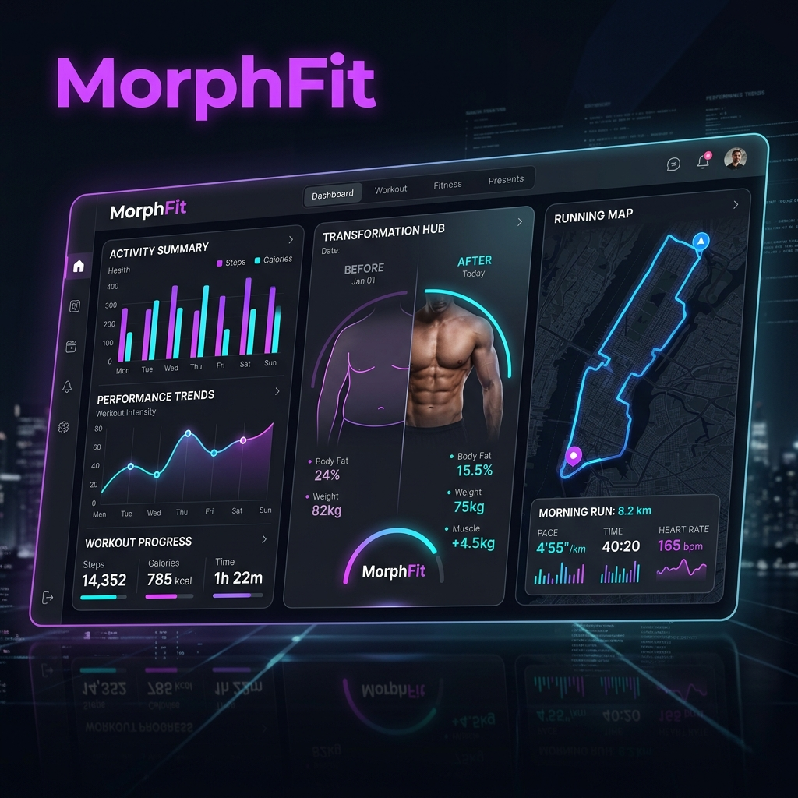

# <p align="center">MorphFit</p>

<p align="center">
  
</p>

<p align="center">
  <strong>MorphFit: Your Journey, Visualized.</strong><br>
  A premium, privacy-focused fitness companion for tracking physical evolution, workouts, and runs.
</p>

---

## 🌟 Overview

**MorphFit** is designed for those who want more than just numbers. It focuses on **Physical Evolution**—visualizing your transformation through time with "Ghost Camera" overlays and precise session tracking. Built with a sleek, high-tech dark interface, MorphFit ensures your data stays your own with secure local storage.

## 🚀 Key Features

### 📸 Physical Evolution & Ghost Camera
Track your transformation with precision. Use the **Ghost Camera** to overlay previous progress photos while taking new ones, ensuring consistent angles and posture for every comparison.
- **Progress Mirror**: Side-by-side comparisons of your journey.
- **Evolution Metadata**: Automatic date and calendar integration for every milestone.
- **Export to Gallery**: Share your progress with watermarked comparisons.

### 🏋️ Workout Suite
Log your strength sessions with ease. Optimized for the "Big 6" and custom exercises.
- **Rep & Volume Tracking**: Focus on your sets while the app handles the math.
- **Personal Records**: Automatically track hits and breakthroughs.
- **Historical Insights**: Visualize your volume progression over time.

### 🏃 Precision Running
Integrated GPS tracking for your cardio sessions.
- **Real-time Map**: Watch your route unfold with `flutter_map`.
- **Run Summaries**: Detailed analysis of pace, distance, and duration.
- **Session History**: All your runs stored securely and locally.

### 🔐 Privacy First
Your fitness journey is personal. MorphFit keeps it that way.
- **Local Vault**: No cloud syncing; your photos and data stay on your device.
- **Biometric Lock**: Protect your progress with fingerprint or face ID.
- **No Trackers**: Zero telemetry, zero bloat.

## 🛠️ Tech Stack

- **Core**: [Flutter](https://flutter.dev) & [Dart](https://dart.dev)
- **UI & Animation**: `animate_do`, `flutter_svg`, `google_fonts`
- **Mapping**: `flutter_map`, `geolocator`, `latlong2`
- **State Management**: custom `InheritedNotifier` provider pattern
- **Storage**: `shared_preferences` (Secure Vault interface)
- **Utilities**: `image_picker`, `screenshot`, `gal`, `intl`

## 🚦 Getting Started

### Prerequisites

- Flutter SDK (v3.11.4 or higher)
- Android Studio / VS Code with Flutter extension
- An Android/iOS device or emulator

### Installation

1.  **Clone the repository**:
    ```bash
    git clone https://github.com/yourusername/morphfit.git
    cd morphfit
    ```

2.  **Install dependencies**:
    ```bash
    flutter pub get
    ```

3.  **Run the application**:
    ```bash
    flutter run
    ```

## 🎨 Design Philosophy

MorphFit follows a **Premium Dark** aesthetic, utilizing glassmorphism and neon accents (Purple/Cyan) to create a futuristic and motivating atmosphere. Every interaction is enhanced with micro-animations from `animate_do`.

## 📜 License

This project is licensed under the MIT License - see the [LICENSE](LICENSE) file for details.

---

<p align="center">Made with ❤️ for the Fitness Community</p>
